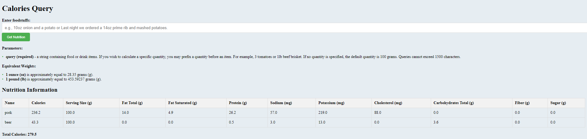

# Calories Query

Calories Query is a web application that allows users to retrieve nutrition information for various food and drink items by sending a query to an external API. This project is built using Java, Spring Boot, Thymeleaf, and the CalorieNinjas API.

## Table of Contents

- [Features](#features)
- [Prerequisites](#prerequisites)
- [Getting Started](#getting-started)
- [Usage](#usage)


## Features

- **Nutrition Data Retrieval:** Users can enter food or drink items as a query, and the application will fetch nutrition information from the CalorieNinjas API.

- **Equivalent Weights:** The application supports specifying quantities for food items, such as ounces (oz) and pounds (lb), and provides equivalent weights in grams (g).

- **Display Nutrition Information:** Retrieved nutrition information, including calories, serving size, fat content, protein, and more, is displayed in a user-friendly table.

- **Total Calories Calculation:** The application calculates and displays the total calories for all items in the query.
  
## Prerequisites

Before you begin, ensure you have met the following requirements:

- [Java Development Kit (JDK)](https://www.oracle.com/java/technologies/javase-downloads.html) installed.
- [Apache Maven](https://maven.apache.org/download.cgi) installed (for building the project).
- API key from the CalorieNinjas API. Set your API key in the `application.properties` file as described in the project [configuration](#configuration) section.

## Getting Started

To get started with this project, follow these steps:

1. Clone the repository to your local machine:

   ```bash
   git clone https://github.com/RomanIgor/Calories-Query.git
2. Navigate to the project directory:
   ```bash
   cd calories-query
3. Open the src/main/resources/application.properties file and replace "your-api-key" with your Calorie Ninjas API key:
      - api.key=your-api-key
4. Build and run the application:
   ```bash
   mvn spring-boot:run
5. Open your web browser and access the application at http://localhost:8080/api/nutrition/fetch?query=

## Usage
Open the web application in your browser.
Enter food or drink items in the input field. You can specify quantities, such as "3 tomatoes" or "1lb beef brisket."
Click the "Get Nutrition" button to retrieve nutrition information.
The application will display the nutrition data, including calories, serving size, and other details.